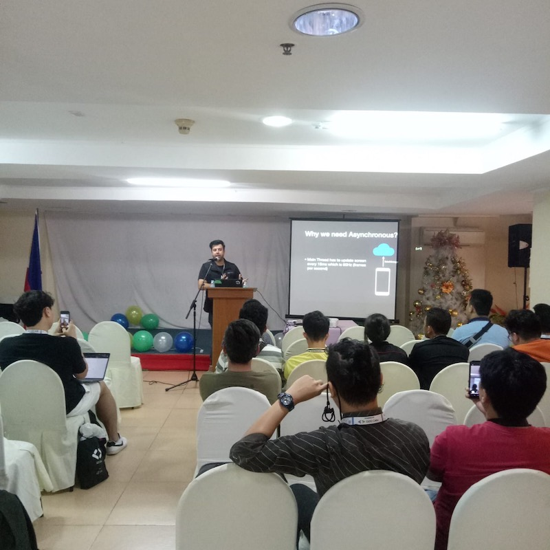

## Slides
[Speakerdeck link](http://speakerdeck.com/oembed.json?url=https://speakerdeck.com/hassanabidpk/improving-app-performance-with-kotlin-coroutines)

Coroutines were added to Kotlin in version 1.3 and since then they became a popular choice for android developers to simplify code that executes asynchronously. Coroutines are lightweight threads and on android they help to solve the primary problems of long running tasks that might block the main thread and also providing safety for offloading network or disk operations from the main thread. This talk will show you how to get started with coroutines in Android, and how you can replace RxJava with coroutines. This talk also covers how coroutines work with architecture components

